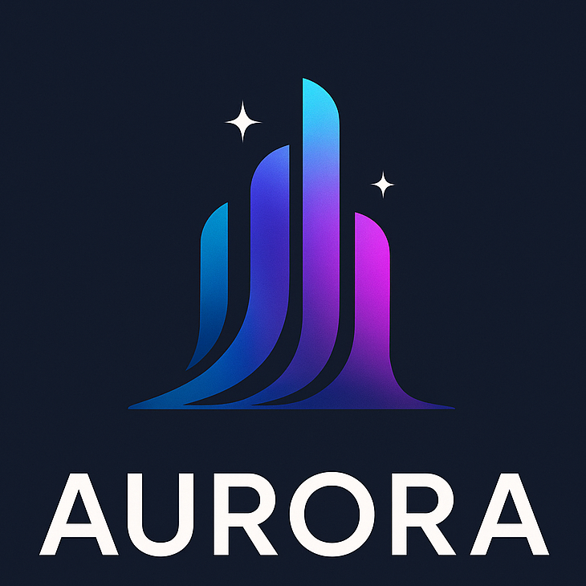

## Overview

Aurora is an open-source, real-time platform that bridges the gap between Apache Kafka's high-throughput event streaming capabilities and the analytical needs of data teams.

Deployed to AWS via our CLI, it enables natural language queries and visualizations of Kafka streams with AI, ClickHouse, and Grafana.

To learn more about the platform, visit our [website](https://auroraplatform.github.io) and read our [case study](https://auroraplatform.github.io/case_study/introduction/).

To get started using Aurora, follow instructions in our [docs](https://auroraplatform.github.io/docs/install/).

## The Team

**[Kana Miyasato](https://github.com/kanamiyasato)** • _Software Engineer_ • Richmond, VA

**[Matic Kocijančič](https://github.com/kocijancic)** • _Software Engineer_ • Ljubljana, Slovenia

**[Patricia Carlos](https://github.com/pkcarlos)** • _Software Engineer_ • San Francisco Bay Area, CA